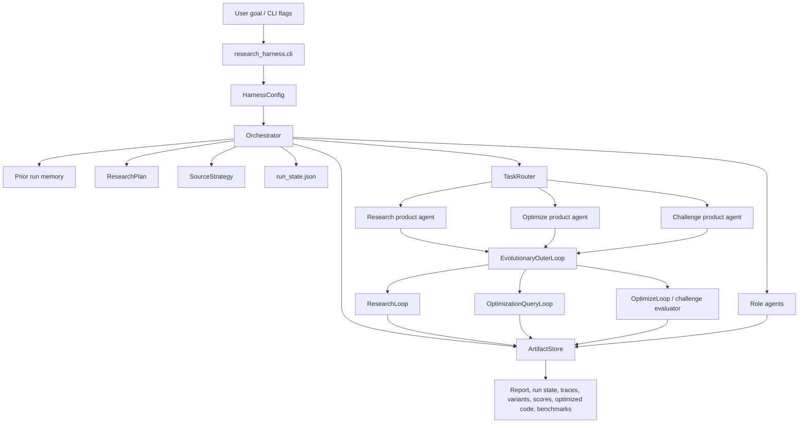
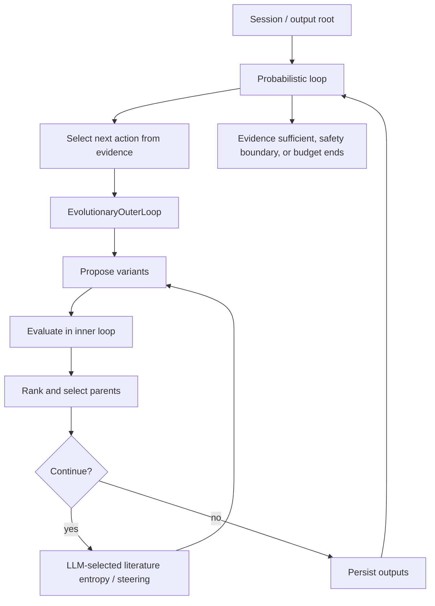
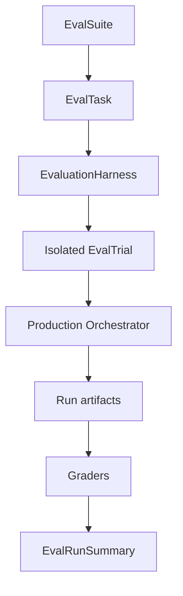

# Research Harness Architecture

`research-harness` is a local agent harness for research, optimization, and
challenge-solving runs. The core design rule is:

```text
agent = model + harness
```

The model is `LLMClient` or a compatible client. The harness is everything that
makes the model act reliably: routing, loops, tools, evaluators, artifact store,
budgets, traces, run state, stopping rules, and benchmark/eval reporting.

## Repository Map

| Path | Role |
| --- | --- |
| `autore`, `autore-bench` | Thin shell entrypoints for the CLI and benchmark runner. |
| `research_harness/cli.py` | Interactive and flag-driven CLI; creates `HarnessConfig` and starts the orchestrator. |
| `research_harness/orchestrator.py` | Top-level run coordinator: product-agent routing, evidence-driven action selection, source strategy, sessions, finalization. |
| `research_harness/loops.py` | Runtime loop core: routing, research/query loops, optimization loops, prediction-market challenge logic, plateau/entropy policies, output rendering. |
| `research_harness/loop_routing.py` | Evaluator registry and task/product-agent routing. |
| `research_harness/loop_evaluators.py` | Evaluator result dataclass and normalization/JSON failure helpers. |
| `research_harness/loop_objectives.py` | Objective parsing and optimization-result objective metadata. |
| `research_harness/loop_utils.py` | Shared loop utilities for tracing, score history, context terms, summaries, and support labels. |
| `research_harness/agents.py` | Role-agent workers: literature, hypothesis, critic, synthesis, and harness debugger. |
| `research_harness/search.py` | Retriever abstraction and backends for local corpus, academic APIs, web/docs/social/code, memory, and Alchemy. |
| `research_harness/store.py` | File-backed artifact store plus SQLite world-model mirror and provenance edges. |
| `research_harness/schemas.py` | Dataclasses for runs, actions, variants, evaluations, claims, traces, costs, and research plans. |
| `research_harness/llm.py` | Live OpenAI/Anthropic/local fallback model client, token/cost accounting, JSON completion wrapper. |
| `research_harness/run_benchmarks.py` | Per-run benchmark summaries, Mermaid/SVG/PNG/HTML/Notebook artifacts, optimizer and champion visualizations. |
| `research_harness/benchmark.py` | Cross-run benchmark dashboard generation. |
| `research_harness/evals/` | Black-box eval harness, suites, trajectory matching, and graders. |
| `challenges/prediction_market/` | Lightweight local prediction-market evaluator adapter. |
| `challenges/prediction-market-challenge/` | Vendored/upstream-style orderbook prediction-market challenge runner. |
| `prompts/` | Prompt templates for role agents. |
| `skills/` | Local Codex skills that encode project invariants and workflows. |
| `services/` | Notes for external service directions. |
| `docs/` | Architecture, schema docs, and diagram generation scripts/assets. |

## Product Agents

The product agent is first-class and separate from the runtime loop mode.

| Product agent | Main modes | Purpose |
| --- | --- | --- |
| `research` | `research` | Retrieve evidence, extract claims, generate hypotheses, critique, and synthesize reports. |
| `optimize` | `optimize`, `optimize_query` | Improve candidates against deterministic evaluators/tests. |
| `challenge` | `optimize_query` then `optimize` | Use the optimization core with challenge specs, proxy/official scoring, and solution rendering. |

`optimize` and `challenge` share the optimization core. A challenge run is an
optimization run with extra contracts: challenge-specific evaluator, candidate
containment, `solution.py` mirroring when needed, official-run metadata, and
challenge graders.

## Runtime Flow



The orchestrator owns run lifecycle. It creates the state store, dispatches to
the selected runtime mode, catches interrupts into a
partial synthesis flow, records cost, generates run benchmarks, and updates the
final run-state record.

## Role Trajectory Model

The harness should not treat agentic execution as merely splitting work into
parallel chunks. Each role has one goal, a narrow context budget, and a handoff
boundary that keeps its trajectory directionally consistent.

| Role | Single goal | Context it should read | Handoff boundary |
| --- | --- | --- | --- |
| Orchestrator | Maintain boundaries and surface current evidence. | Run state, evaluator feedback, compact artifact summaries, and validator findings. It does not prescribe a fixed trajectory. | Delegates or selects work only when current evidence justifies it. |
| Worker | Complete one well-specified feature, candidate mechanism, or artifact with clear success criteria. | Feature contract, directly relevant source files/artifacts, operational guidelines, and focused research notes. | Stops when it believes the work is ready; independent validation decides correctness. |
| Validator | Evaluate completed work for correctness and completeness. | Validation contract, completed artifacts, tests, traces, and expected behavior. | Reports gaps to the orchestrator; does not implement fixes. |
| Optimization controller | Choose the next optimization direction and tool sequence needed to improve evaluator score. | Champion, recent failures, evaluator summary, variant comparison, targeted literature, and compact previous controller state. | Produces prompt context for candidate-generation workers and leaves correctness to evaluator/validator gates. |

The full state lives in shared artifacts instead of any single agent's context:
`run_state.json`, `optimizer_seed_context.json`, `optimization_agent_steps.json`,
`optimizer_agent_summary.md`, `role_trajectory_contract.md`, traces, variants,
evaluations, literature claims, and validation reports. Agents read what is
relevant to their current job and avoid context that is unrelated to their
single goal or incentive.

## Three Loop Model

The current code has three nested control concepts:

| Loop | Implementation | Responsibility |
| --- | --- | --- |
| Session loop | `sessions.py`, `Orchestrator._start_session_store` | Context isolation and optional cross-run session memory. |
| Probabilistic loop | `Orchestrator._run_loop` and loop-action helpers | Select the next action from current evidence and evaluator feedback, record it in `run_state.json`, and stop on sufficient evidence, safety boundary, or budget. |
| Evolutionary loop | `EvolutionaryOuterLoop` in `loops.py` | Propose query/code variants, evaluate, rank, select parents, detect plateau, introduce entropy, and persist best artifacts. |



## Orchestrator

`HarnessConfig` contains the run policy: mode, retriever, iteration budget,
product-agent knobs, evaluator name, challenge preset, optimizer population,
parent count, evaluator parallelism, plateau patience, LLM provider/model,
sessions, and steering.

`Orchestrator.run()` performs the main lifecycle:

1. Load prior run memory from completed output directories.
2. Build a `ResearchPlan` with goal interpretation, task type, topics, and
   source strategy hints.
3. Choose source backends from the plan and retriever config.
4. Create `RunRecord`, session state, and `ArtifactStore`.
5. Initialize `run_state.json`.
6. Run deterministic, standard/fanout, or evolutionary/loop mode.
7. On interrupt, synthesize partial artifacts instead of losing the run.
8. Finalize status, cost, run state, benchmark visuals, and run metadata.

The challenge preset adjusts defaults: at least 20 iterations unless the user
explicitly capped them, optimizer population at least 48, query research fan-out
default 16, parent count at least 4, wider evaluator parallelism, and continued
optimization on plateau.

## Loops

`loops.py` remains the public compatibility surface for loop-related symbols and
the home of the large runtime loop classes. Several helper concerns have been
split out already:

| Module | Responsibility |
| --- | --- |
| `loop_routing.py` | `EvaluatorRegistry`, `TaskRouter`, optimization-query routing hints, product-agent routing. |
| `loop_evaluators.py` | `EvaluatorResult`, evaluator payload normalization, exception-to-result conversion, JSON result shaping. |
| `loop_objectives.py` | Profit/score objective extraction and objective metadata for run outputs. |
| `loop_utils.py` | Timing traces, trace component mapping, score history, JSON evaluator response extraction, context terms, support levels, shortening. |

The remaining `loops.py` concerns are:

| Concern | Current symbols |
| --- | --- |
| Inner loops | `ResearchLoop`, `OptimizationQueryLoop`, `OptimizeLoop`, `InnerLoopResult`. |
| Outer loop | `EvolutionaryOuterLoop`, parent selection, continuation decisions, evidence-facing output. |
| Plateau/entropy | `PlateauDetector`, `DirectionSpec`, forced directions, LLM entropy-axis selection, recovery metadata. |
| Optimization artifacts | best candidate selection, `optimized_candidate.txt`, `optimal_code.py`, `optimization_result.json`. |
| Prediction-market challenge | upstream path discovery, sandbox/local/official scoring, candidate rendering, solution mirroring. |

The loop policy is not a predefined trajectory. For optimizer/challenge runs,
the harness grounds before optimization, evaluates a round, and if the run
continues it asks the LLM to choose a fresh literature-search axis from the
goal, score history, recent literature, and user steering. That literature
context is then included in the next code-generation prompt.

## Should `loops.py` Be Split?

Yes. The first compatibility-preserving extraction has moved routing, evaluator
normalization, objective parsing, and shared utilities into dedicated modules.
`loops.py` is still large because it holds inner loops, the evolutionary outer
loop, entropy policy, optimization output rendering, and prediction-market
adapter code. A good next target shape:

| New module | Move from `loops.py` |
| --- | --- |
| `inner_loops.py` | `InnerLoop`, `ResearchLoop`, `OptimizationQueryLoop`, `OptimizeLoop`, `InnerLoopResult`. |
| `evolution.py` | `EvolutionaryOuterLoop` orchestration, parent selection, continuation decisions, output dispatch. |
| `entropy.py` | `PlateauDetector`, `DirectionSpec`, forced directions, LLM entropy-axis policy, recovery helpers. |
| `optimization_outputs.py` | best-candidate rendering and universal optimization artifact contract. |
| `prediction_market_adapter.py` | challenge-specific solution rendering and official/local/sandbox scoring. |

Recommended sequence:

1. Keep `research_harness.loops` re-exporting public names so existing imports
   and tests keep working.
2. Move prediction-market adapter next; it has the clearest remaining boundary.
3. Move inner loops, then entropy, then the outer loop last.
4. Only after extraction, consider renaming public imports in callers.

## Role Agents

`agents.py` defines worker agents used by the orchestrator and synthesis flow:

| Agent | Writes |
| --- | --- |
| `LiteratureAgent` | Sources and claims from planned search work. |
| `HypothesisAgent` | Hypotheses, experiments, and open questions. |
| `CriticAgent` | Contradictions, challenged claims, and failed paths. |
| `SynthesisAgent` | `final_report.md`, LaTeX/PDF/preview artifacts where possible. |
| `HarnessDebuggerAgent` | Failure diagnoses and proposed harness changes. |

These are role workers inside the harness, not standalone product agents. The
product agent is still the model plus the loop/tool/store policy around them.

## Retrieval Layer

`search.py` exposes a `SearchBackend` interface and concrete retrievers:

- `LocalCorpusSearch` for offline deterministic tests and demos.
- `ArxivSearch`, `OpenAlexSearch`, and `SemanticScholarSearch` for papers.
- `GitHubSearch`, `WebSearch`, `DocsBlogsSearch`, and `SocialWebSearch` for
  implementation, web, docs/blog, and social evidence.
- `AlchemySearch` for blockchain data.
- `WikipediaSearch` for broad background.
- `PriorArtifactMemorySearch` for previous run outputs.

Backends return `CorpusDocument` records. The store converts them into `Source`
and `Claim` artifacts, with provenance edges and dedupe.

## Artifact Store And World Model

Each run writes append-friendly JSON collections inside `outputs/<run_id>/`.
`ArtifactStore` also mirrors records into `world_model.sqlite` under the output
root. The SQLite mirror supports cross-run dedupe, provenance queries, and
observability.

Important artifacts:

| Artifact | Meaning |
| --- | --- |
| `run_state.json` | Product agent, task mode, agent-harness boundaries, observed actions, evidence, stopping rationale, artifact paths. |
| `progress.txt` | Human-readable step log. |
| `trace.jsonl`, `agent_traces.json` | Timing, prompts, model labels, tool calls, errors, and failure localization. |
| `sources.json`, `claims.json`, `hypotheses.json` | Research world model for a run. |
| `variants.json`, `variant_evaluations.json`, `evolution_rounds.json` | Optimization/research loop trajectory. |
| `loop_continuation_decisions.json` | Explicit continue/exit decisions and reasons. |
| `optimizer_seed_context.json` | Research findings used to steer optimizer code generation. |
| `optimized_candidate.txt`, `optimal_code.py`, `optimization_result.json` | Universal optimization output contract. |
| `solution.py` | Optional challenge-specific runnable mirror. |
| `champion_tree.*` | Parent-child lineage and current champion visualization. |
| `run_benchmark.*`, `agent_timeline.*`, `decision_dag.*` | Run inspection and visualization artifacts. |
| `cost.json`, `cost_events.json` | Token/cost accounting. |
| `harness_diagnosis.json`, `harness_changes.json` | Failure taxonomy and proposed harness improvements. |

## Probabilistic Loop Contract

Every product-agent run writes `run_state.json`. It records actions after they
occur rather than creating a user-story-shaped plan:

```json
{
  "id": "US-001",
  "title": "Concrete task title",
  "acceptanceCriteria": ["Observable criterion"],
  "passes": false
}
```

The run state also records selected `product_agent`, selected runtime `task_mode`,
agent-harness boundaries, artifact paths, source strategy, stopping rules, and
progress. It is updated after each action and again during finalization.

## Optimization And Challenge Outputs

Any run that executes an optimization evaluator must emit:

```text
optimized_candidate.txt
optimal_code.py
optimization_result.json
```

`optimization_result.json` includes score details, `candidate_path`, and
`optimal_code_path`. Challenge adapters may additionally write `solution.py`,
but `solution.py` is never a substitute for `optimal_code.py`.

Prediction-market challenge scoring has three paths:

1. Official upstream runner when `PREDICTION_MARKET_USE_UPSTREAM=1`.
2. Local sandbox strategy execution.
3. Local semantic fallback if execution is unavailable.

The cheap default prediction-market protocol uses paired common-random-number
style metadata: the same seed range across variants, 24 simulations by default,
and metrics that state whether the score is official, sandboxed, eligible, or
unmeasured.

## Evaluation Harness

`research_harness/evals/` treats the production harness as a black box.



The suites cover core flows, edge cases, and preflight gates. Graders check
outcomes, observed-action integrity, trajectory shape, loop behavior, optimizer artifacts,
prediction-market containment/status, research groundedness, source diversity,
and LLM-style quality judgments.

`trajectory.py` produces normalized trajectory events and graphs. Its optimizer
flow helper checks that continued rounds have post-round entropy evidence, not
just a label.

## Benchmark And Visualization Layer

`run_benchmarks.py` generates per-run inspection artifacts:

- timeline/Gantt views from agent traces,
- decision DAGs,
- optimizer flow diagrams,
- score spread/stddev summaries,
- champion lineage graphs,
- run benchmark HTML/Markdown/Notebook outputs.

`benchmark.py` aggregates many run directories into CSV, JSON, and HTML
dashboards under `benchmarks/`.

## Sessions, Steering, And Memory

`sessions.py` stores project/session records under a session projects directory.
The orchestrator can resume or fork session context.

`steering.py` starts a background terminal input loop. During a run, `/article`,
`/steer`, and `/note` are appended to an inbox. `ArtifactStore` ingests pending
steering into sources/claims before proposal rounds so user input can affect the
next iteration.

Prior run memory is loaded from previous outputs and summarized into directions
to avoid, unresolved directions, open questions, and prior report hints.

## LLM And Model Selection

`LLMClient` supports:

- OpenAI,
- Anthropic,
- `auto`,
- `all-configured` round-robin across available configured models,
- local deterministic fallback.

All model calls record prompt/completion token estimates or provider usage,
estimated cost, model label, provider, status, and errors. JSON completions use
`complete_json()`, which raises `LLMError` if the response is not valid JSON.

## Diagnostics And Harness Evolution

`diagnostics.py` classifies failures by component and category, compares trace
patterns to prior runs, and scores proposed harness changes.
`HarnessDebuggerAgent` writes `harness_changes.json` records. Evals and tests
guard against reward-hacking patterns such as fabricated sources, missing best
code artifacts, hyperparameter-only plateau recovery, and candidate leakage into
the repository root.

## Tests

Primary local verification:

```bash
python3 -m unittest tests.test_smoke
python3 -m unittest tests.test_terminal_bench
python3 -m research_harness.evals --suite core --trials 1
```

`tests/test_smoke.py` is the broad contract suite. `tests/test_terminal_bench.py`
checks terminal-bench adapter contracts, with live Harbor/Docker checks gated by
environment variables.
