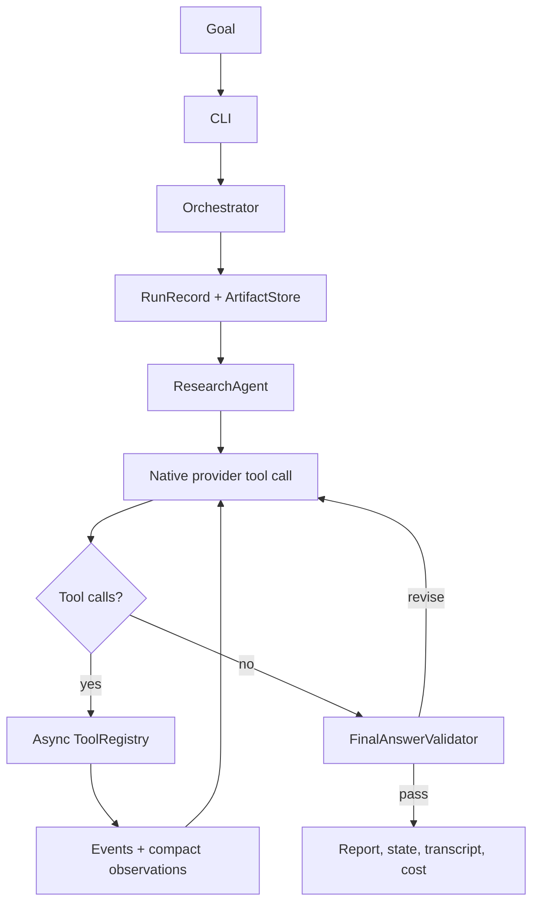

# Research Harness Architecture

`autore` has one production execution architecture: a model-directed agent loop. The model chooses whether to answer, use tools, revise after an observation, request user input, or finish. The harness controls only safety, capability boundaries, budgets, persistence, validation, and deterministic evaluation.

There is no execution-mode flag, plan builder, task router, phase dispatcher, or fixed research sequence in the production path.

## Production path



`Orchestrator.run(goal)` initializes the run, creates one `ResearchAgent`, awaits it, and persists its actual trajectory. It does not create a research plan or select a runtime architecture.

## Model and provider boundary

`LLMClient.complete_turn()` translates OpenAI, Anthropic, or compatible Ollama native tool-use responses into `ModelTurn`:

```text
text
tool_calls[]  { id, name, arguments }
stop_reason
usage and cost
```

Tool-call IDs are retained in assistant and tool-result messages. Every provider-native call receives a matching tool-result message, including a structured `skipped` result when a safety budget prevents execution. This keeps provider conversation history valid rather than turning a budget limit into an HTTP 400.

The model’s visible text and a concise public tool-decision summary are recorded. Hidden chain-of-thought is neither requested nor persisted.

## Tool boundary

All integrations live behind `ToolRegistry`:

| Capability | Tool | Boundary |
| --- | --- | --- |
| Evidence discovery | `SearchTool` backends | Search results are source records, not raw HTTP in the agent loop. |
| Public documents | `fetch_document` | DNS/redirect SSRF checks; optional curl.md HTML-to-Markdown rendering. |
| Workspace inspection | `read_workspace_file` | Explicit roots only; `.env`, `.git`, credentials, and secret paths denied. |
| Analysis | `execute_python_analysis` | Network-isolated sandbox; no workspace modification. |

Tools implement async execution. Independent read-only calls run concurrently; mutating calls are sequential. Schema validation happens before execution. Errors are observations returned to the same model trajectory.

## Retrieval quality controls

- DuckDuckGo anti-bot pages are explicit tool failures, never empty successful searches.
- arXiv identifiers (for example `1606.06565`) use `id_list` lookup.
- Text arXiv searches preserve the agent’s query without unrecorded LLM rewrites and reject papers with insufficient lexical overlap.
- Full sources are stored in `sources.json`; compact title, URL, relevance, and bounded summaries are sent back to the model to prevent context blowups.
- A task explicitly asking for external sources cannot pass final validation without retrieved evidence.

## Event history and artifacts

Every run directory contains:

| Artifact | Meaning |
| --- | --- |
| `agent_events.jsonl` | Append-only event stream: model turn, tool request, tool result, validation, and termination. |
| `agent_messages.json` | Full provider-neutral conversation and final event snapshot. |
| `run_state.json` | Current authoritative trajectory snapshot derived from actual events. |
| `failed_paths.json` | Tool/provider/runtime failures and budget/safety rejections. |
| `sources.json` | Durable, deduplicated evidence records. |
| `final_report.md` | Validated answer or clearly labelled partial synthesis. |
| `cost.json` / `cost_events.json` | Provider token usage and estimated cost. |

`progress.txt` prints a concise stream of model turns and each requested/completed tool call. Event and failure records survive even if a later model request fails.

## Deterministic capabilities outside the production path

The repository still contains evaluator, optimization, prediction-market, benchmark, and experiment utilities. They are deterministic capabilities and test fixtures; they are not alternative top-level execution paths. A future agent-facing experiment adapter must preserve the separation: the model may propose or inspect an experiment, but deterministic evaluator and promotion policy own execution and promotion.

## Configuration

`HarnessConfig` is a policy object, not a trajectory selector. It contains retriever availability, model/provider selection, iteration/tool/runtime/cost budgets, approved workspace roots, sessions, output location, and optional evaluator availability.

The public CLI exposes a goal, retriever availability, model selection, and budgets. It does not expose `--mode`, fixed research phases, or an optimizer-routing choice.

## Verification

```bash
env PYTHONPYCACHEPREFIX=/private/tmp/research-harness-pycache python3 -m unittest discover -s tests
autore --help
```

The tests cover direct answers, model-requested tools, concurrent read-only calls, provider tool-call/result pairing, citation revision, output-limit continuation, restricted-file access, SSRF rejection, retrieval relevance, and error persistence.
