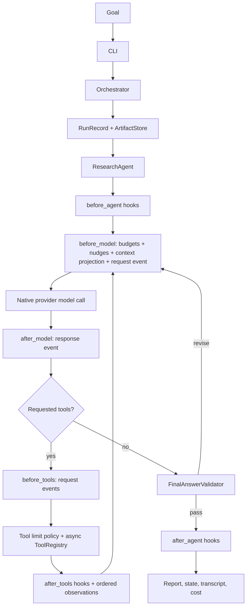
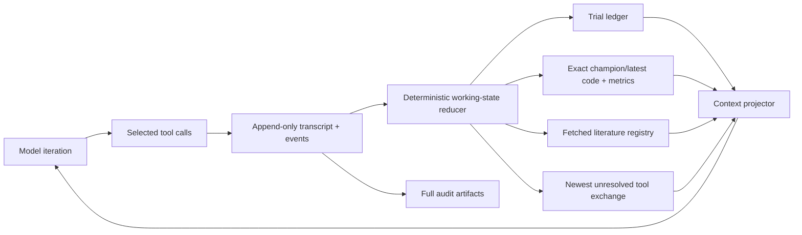
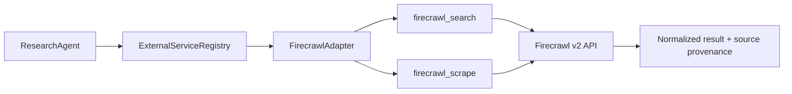
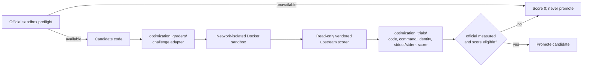

# Research Harness Architecture

`autore` has a model-directed research path and a registered-grader optimization path. The model chooses whether to answer, use tools, revise after an observation, request user input, or finish; an optimization grader instead owns candidate scoring and promotion eligibility. The harness controls safety, capability boundaries, budgets, persistence, validation, and deterministic evaluation.

There is no execution-mode flag, plan builder, task router, phase dispatcher, or fixed research sequence in the production path.

## Production path



`Orchestrator.run(goal)` initializes the run and persists its actual trajectory. It always creates one `ResearchAgent`; a registered optimization grader is exposed as a controlled tool, not a second orchestration path. It does not create a research plan.

## Agent loop and state

`AgentLoop.run()` owns trajectory control only:

```text
initialize AgentState
→ run pre-model policies
→ call the model
→ inspect the response
→ execute requested tools
→ append ordered observations
→ validate a proposed final answer
→ revise or terminate
```

`AgentState` is the single mutable record for a trajectory. It owns the objective, append-only provider-neutral audit messages, the current projected model context, tool-call records, events, sources and canonical source URLs, answer chunks, current iteration, source-stall count, start time and initial cost, and termination fields. This prevents policy state from being spread across independent locals in the loop.

For configured grader runs, audit history and model working context are intentionally different:



The model does not receive the entire historical transcript on every grader iteration. It receives the original objective and system contract, a compact ledger of all measured and failed candidate attempts, exact current champion and latest-candidate code when those are not already in the newest native tool exchange, official component metrics, verified fetched-document extracts with locators, and only the newest unresolved tool exchange. Failed or ineligible grader attempts remain visible in the ledger but can never become champion state. Discovery leads do not enter durable literature working memory until their primary document is fetched.

The model remains the cognitive controller. No middleware chooses a research topic, routes a task, or imposes a fixed research sequence.

## Middleware and policy boundaries

The internal middleware stack is deliberately small. Its ordered async lifecycle hooks are `before_agent`, `before_model`, `after_model`, `before_tools`, `after_tools`, and `after_agent`.

- `BudgetPolicy` enforces cancellation, wall-clock runtime, and incremental model-cost limits before model calls.
- `NudgePolicy` inserts the existing source-refresh and grader-action guidance and records those insertions.
- `ContextCompactionMiddleware` deterministically reduces grader audit history into lossless working state before each model request. It never asks a model to paraphrase exact code or scores.
- `EventLoggingMiddleware` observes model/tool lifecycle boundaries. `EventRecorder` owns event sequence numbers, JSONL persistence, progress output, and failed-path recording.
- `ToolLimitPolicy` is a named domain policy rather than middleware. It preserves successful-evidence budgeting and deterministic grader-call limits.
- `ResultBuilder` constructs completed, needs-input, and partial results and records explicit termination.

Transport-level retries remain inside `LLMClient`. If those are exhausted by a retryable timeout or provider status, `AgentLoop` retries one model turn with the identical projected state; deterministic request or history errors are not retried. Kimi's default per-request timeout is 120 seconds because native tool-use reasoning can exceed the generic 60-second window.

Middleware can observe or constrain execution, but it does not select tools or manufacture results.

## Final-answer validation

`validation/final_answer.py` is an explicit domain component. `FinalAnswerValidator.validate()` returns an immutable `ValidationResult(status="pass" | "revise", feedback=...)`. The loop either completes or appends that feedback to the same model trajectory. Citation allowlisting, lead-source rejection, claim-level support, output-limit continuation, and revision behavior remain outside generic middleware.

## Model and provider boundary

`LLMClient.complete_turn()` translates OpenAI, Anthropic, or compatible Ollama native tool-use responses into `ModelTurn`:

```text
text
tool_calls[]  { id, name, arguments }
stop_reason
usage and cost
```

Tool-call IDs are retained in assistant and tool-result messages. Every provider-native call receives a matching tool-result message, including a structured `skipped` result when a safety budget prevents execution. This keeps provider conversation history valid rather than turning a budget limit into an HTTP 400.

The model’s visible text and a concise public tool-decision summary are recorded. Hidden chain-of-thought is neither requested nor persisted.

## Tool boundary

All integrations live behind `ToolRegistry`:

| Capability | Tool | Boundary |
| --- | --- | --- |
| Evidence discovery | `SearchTool` backends | Search results are source records, not raw HTTP in the agent loop. |
| Public documents | `fetch_document` | DNS/redirect SSRF checks; bounded download independent of extracted-text budget; optional curl.md HTML-to-Markdown rendering. |
| External services | `ExternalServiceRegistry` adapters | Optional provider tools with service-specific auth, normalization, errors, and source provenance. |
| Workspace inspection | `read_workspace_file` | Explicit roots only; `.env`, `.git`, credentials, and secret paths denied. |
| Analysis | `execute_python_analysis` | Network-isolated sandbox; no workspace modification. |
| Structured extraction | `extract_structured_data` | Operates on a verified fetched source; saves normalized datasets with section/table/row provenance and returns a bounded preview. |
| Document analysis | `analyze_research_document` | Configured LLM receives bounded verified evidence and must separate directly stated findings from inferences with locators. |
| SVG visualization | `generate_svg_chart` | Reads a persisted dataset by ID, validates selected numeric columns and units, and saves deterministic SVG/config/provenance artifacts. |

Tools implement async execution. Independent read-only calls run concurrently; mutating calls are sequential. Schema validation happens before execution. Errors are observations returned to the same model trajectory.

`ToolExecutor` keeps result normalization behind the registry boundary. Provider-native call IDs are copied unchanged into assistant and tool messages. Although read-only work may complete concurrently, results, source commits, events, and messages are recorded in the model-requested order.

External services have a second, provider-level boundary before they enter the
tool registry:



The default registry includes Firecrawl as an optional search and scrape
provider. Credentials are read only from `FIRECRAWL_API_KEY` at execution time;
the model never receives them. The adapter uses the documented keyless fallback
when the environment variable is absent, rejects non-public scrape targets, and
records endpoint, sanitized request, access mode, and reported credits with the
source artifact.

## Retrieval quality controls

- DuckDuckGo anti-bot pages are explicit tool failures, never empty successful searches.
- arXiv identifiers (for example `1606.06565`) use `id_list` lookup.
- Text arXiv searches preserve the agent’s query without unrecorded LLM rewrites and reject papers with insufficient lexical overlap.
- Full sources are stored in `sources.json`; compact title, URL, relevance, and bounded summaries are returned for the current tool exchange.
- Verified fetched documents become durable grader working memory with bounded extracts and page/section locators. Canonical URL cache hits return the stored document instead of performing another network request.
- A task explicitly asking for external sources cannot pass final validation without retrieved evidence.

## Event history and artifacts

Every run directory contains:

| Artifact | Meaning |
| --- | --- |
| `agent_events.jsonl` | Append-only event stream: model request/start, context projection, model response/end, tool request, tool result, validation, and termination. |
| `agent_messages.json` | Full provider-neutral conversation and final event snapshot. |
| `run_state.json` | Current authoritative trajectory snapshot derived from actual events. |
| `failed_paths.json` | Tool/provider/runtime failures and budget/safety rejections. |
| `sources.json` | Durable, deduplicated evidence records. |
| `final_report.md` | Validated answer or clearly labelled partial synthesis. |
| `cost.json` / `cost_events.json` | Provider token usage and estimated cost. |
| `datasets/`, `document_analyses/`, `charts/` | Optional extraction, grounded analysis, and reproducible SVG artifacts selected by the model. |

`progress.txt` prints a concise stream of model turns and each requested/completed tool call. Event and failure records survive even if a later model request fails.

## Deterministic capabilities outside the production path

The repository still contains evaluator, optimization, prediction-market, benchmark, and experiment utilities. They are deterministic capabilities and test fixtures; they are not alternative top-level execution paths. A future agent-facing experiment adapter must preserve the separation: the model may propose or inspect an experiment, but deterministic evaluator and promotion policy own execution and promotion.

Optimization graders remain registered capabilities with explicit call limits and promotion safeguards. Grader execution and score eligibility are deterministic; grader feedback is an observation available to the model, not grader logic merged into the model loop.

## Optimization grader adapters

Candidate-code graders live in `optimization_graders/`; they are separate from
`research_harness/evals/graders/`, which grades the harness itself. Each
adapter renders a candidate, invokes the official scorer in a bounded sandbox,
and normalizes the result. Vendored sources under `challenges/` are read-only:
the adapter never reimplements their scoring logic.



The prediction-market adapter runs official-sandbox preflight before retrieval,
then invokes the upstream `orderbook-pm` CLI on a fixed seed range. A failure
or skipped official scorer is recorded with score zero and cannot become a
champion.

## Configuration

`HarnessConfig` is a policy object, not a trajectory selector. It contains retriever availability, model/provider selection, iteration/tool/runtime/cost budgets, approved workspace roots, sessions, output location, and optional grader availability.

The public CLI exposes a goal, retriever availability, model selection, budgets, and the current `--grader --grader-loops N` contract. It does not expose `--mode`, `--task-mode`, `--evaluator`, fixed research phases, or an optimizer-routing choice. A new run never scans or registers previous output directories as model evidence.

## Verification

```bash
env PYTHONPYCACHEPREFIX=/private/tmp/research-harness-pycache python3 -m unittest discover -s tests
autore --help
```

The tests cover direct answers, state initialization, model-requested tools, lossless grader context projection, failed-trial negative controls, fetched-document caching, successful-evidence and grader exhaustion, runtime and cost termination, source-refresh nudges, provider failures, concurrent read-only calls with deterministic recording, provider tool-call/result pairing, citation pass and revision, output-limit continuation, artifact/event persistence, restricted-file access, SSRF rejection, and retrieval relevance.
